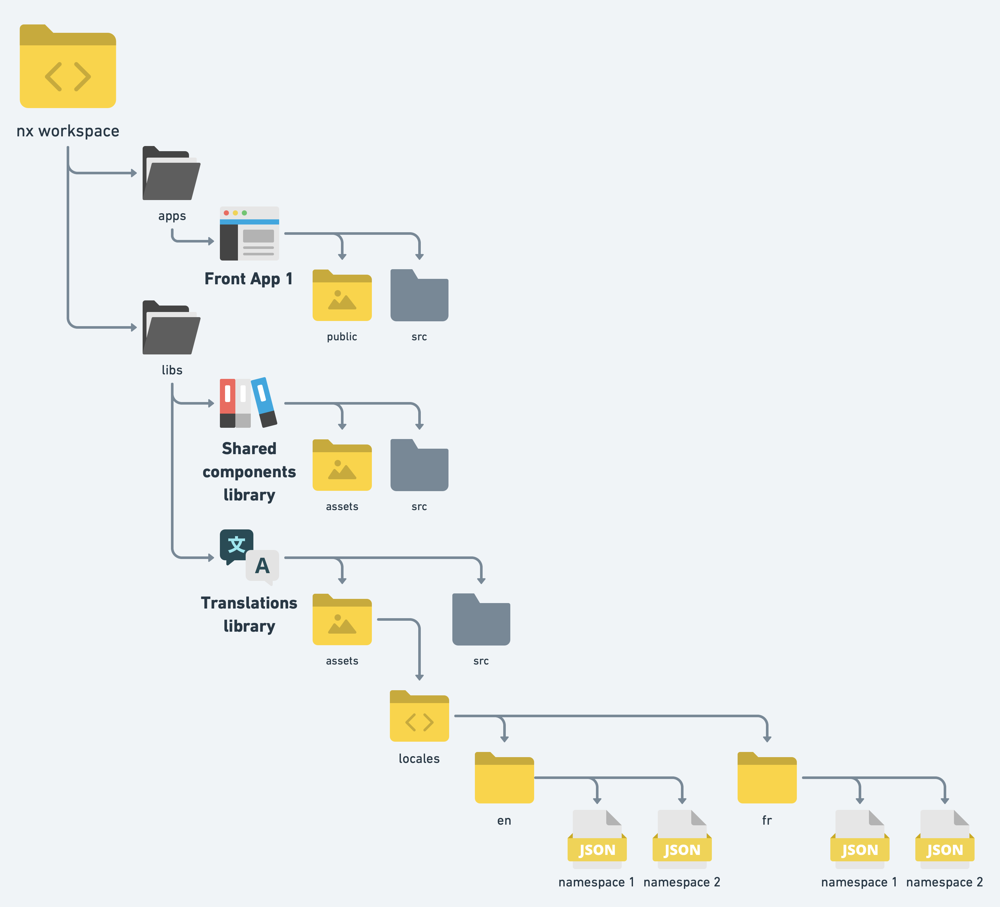

# ⚡ Multi languages support

We will use [next-i18next](https://github.com/isaachinman/next-i18next) for this task. The library is built on top of [react-i18next](https://react.i18next.com) which is the most used tool for internationalization in react ecosystem.

Let's see together how to do that.

## 🔶 Defining / fetching translations

Firstof let's create a library using `@nrwl/node:lib`. The purpose of our new library will be to hold (and possibly fetch) the json files containing our translations.

Translations will be held in json files containing nested json:

```json
{
  "pageTitle": {
    "signup": "Signup",
    "home":"Home"
  },
  "welcomeText": "Welcome!",
  [...]
}
```

We will call them namespaces. A nextjs page can use one or several namespaces, which essentially means the content of the associated json files will be injected in the bundle sent when getting this page. More about this later.

Let's focus on architecture. Our library will then contain an `assets` folder that will store our translations as an arbitrary number of json files (the namespaces).



Why putting them in a lib? Because these files will be used by several applications.

### 🧿 Fetching tranlations

On this POC, translations are defined directly in the json files. However, we may need to get these translations from an external source. To do so, we can easily define a task in the library `project.json` file:

```json
{
  [...]
  "targets": {
    "fetch-translations": {
      "executor": "@nrwl/workspace:run-commands",
      "options": {
        "command": "pnpm fetchTranslations"
      }
    },
    [...]
  },
  [...]
}
```

Here `fetchTranslations` is a npm script defined in `package.json` that will essentially execute the code defined in a typescript file. Note that we could also use ts-node here to directly execute code.

The typescript file could then do something as simple as using fetch to retrieve translations and writing them in the library `./assets/locales` folder.

## 🔶 Integrating our translations in our front apps

Since we are using next, the namespaces must be copied in the `public` folder of each app before building the application. To do so, we will define a task in the `project.json` of each application:

```json
{
  [...]
  "targets": {
    "copy-locales": {
      "executor": "@nrwl/workspace:run-commands",
      "options": {
        "command": "echo Copying locales... && cp -R ./libs/front/translations/assets/locales ./apps/front/public/"
      }
    },
    [...]
  }
  [...]
}
```

Now we need to make sure this task is ran before building the app or launching it in dev mode. To do so, we can use the `dependsOn` property for this. Here is an example with the serve step:

```json
{
  [...]
  "targets": {
    "serve": {
      "executor": "@nrwl/next:server",
      "options": {
        "buildTarget": "front:build",
        "dev": true,
        "port": 3000
      },
      "dependsOn": [
        {
          "target": "copy-locales",
          "projects": "self"
        }
      ],
      "configurations": {
        "production": {
          "buildTarget": "front:build:production",
          "dev": false
        }
      }
    },
    [...]
  }
  [...]
}
```

## 🔶 Configuring translations for a frontend

Firstof, we have to define a `next-i18next.config.js` file at application root:

```javascript
const path = require('path')

module.exports = {
  i18n: {
    defaultLocale: 'en',
    locales: ['en', 'fr'],
  },
  // Here we must specify the path of our namespaces, that will be copied in the public folder.
  localePath: path.resolve(`apps/front/public/locales`),
}
```

## 🔶 Loading namespaces in pages

Namespaces are loaded by page using either `getStaticProps` (SSG) or `getServerSideProps` (SSR). We want to only inject the namespaces that we really need for each page to limit the impact on performances.

In the following example, we are loading the `common` and `home` namespaces.

```typescript
import { serverSideTranslations } from 'next-i18next/serverSideTranslations';

const Home: NextPage = () => <HomeRoot />

export const getStaticProps: GetStaticProps = async ({
  locale,
}: GetStaticPropsContext) => {
  return {
    props: {
      ...(await serverSideTranslations(locale, ['common', 'home'])),
    },
  }  
}

export default Home;
```

## 🔶 Using translations in our components

### 🧿 Using only one namespace

Here, we will give only one string to the `useTranslation` function. Here we are loading the `errors` namespace, that contains in this example:

```json
{
  "genericError": {
    "title": "Oh no!",
    "message":"An unknown error occured"
  }
}
```

```tsx
import { useTranslation } from 'next-i18next';

export const GenericError = () => {
  const { t } = useTranslation('errors');

  return (
    <FullpageError title={t('genericError.title')}>
      {t('genericError.message')}
    </FullpageError>
  );
};
```

### 🧿 Using several namespaces

Sometimes, we have to use translations coming from several namespaces within a component. We can do so by passing an array to the `useTranslation` function.

But it means we will have to preprend our keys with the namespace (`<namespace>:<key>`):

```tsx
import { useTranslation } from 'next-i18next';

export const HomePageError = () => {
  const { t } = useTranslation(['errors', 'home']);

  return (
    <FullpageError title={t('common:generic.pageTitle')}>
      {t('errors:genericError.message')}
    </FullpageError>
  );
};
```

Of course, for this to work, the page using this component must load both `common` and `error` namespaces via `getStaticProps` or `getServerSideProps`.

## 🔶 Translations and storybook

In order to load translations, we have to add a `i18next.js` file in `.storybook` folder that will load all the namespaces and configure i18n.

```javascript
import { initReactI18next } from 'react-i18next';
import i18n from 'i18next';
import LanguageDetector from 'i18next-browser-languagedetector';

const namespaces = [
  'common',
  'forms',
  'signupPage',
  'userInfosPage'
];
const supportedLanguages = ['en', 'fr'];

i18n
  .use(LanguageDetector)
  .use(initReactI18next)
  .init({
    react: { 
      useSuspense: false 
    },
    lng: 'en',
    fallbackLng: 'en',
    interpolation: {
      escapeValue: false,
    },
    defaultNS: 'common',
    ns: namespaces,
    supportedLngs: supportedLanguages,
  });

supportedLngs.forEach((lang) => {
  ns.forEach((namespace) => {
    i18n.addResourceBundle(
      lang,
      namespace,
      require(`../../translations/assets/locales//${lang}/${namespace}.json`)
    );
  });
});

export { i18n };
```

We will patch `main.js` to use [`storybook-react-i18next`](https://storybook.js.org/addons/storybook-react-i18next) addon. We also need to add the locales files to the static files available in storybook. Finally, we will replace `next-i18next` library with `react-i18next`, its base library, since we are not using next at all within storybook.

```javascript
/** @type {import("@storybook/react/types/index").StorybookConfig} */
const storybookMainConfig = {
  addons: [
    [...]
    'storybook-react-i18next',
  ],
  staticDirs: [
    [...]
    '../../../../libs/front/components/assets',
  ],
  webpackFinal: async (config) => {
    [...]

    config.resolve.alias = {
      ...(config.resolve.alias || {}),
      'next-i18next': 'react-i18next',
    }

    return config;
  },
  [...]
};
```

Finally, let's patch `preview.js` to display a language selector in storybook:

```javascript
import { i18n } from './i18next.js'

export const parameters = {
  [...],
  i18n,
  locale: 'en',
  locales: {
    en: { right: '🇫🇷', title: 'Français' },
    fr: { right: '🇬🇧', title: 'English' },
  },
};
```
